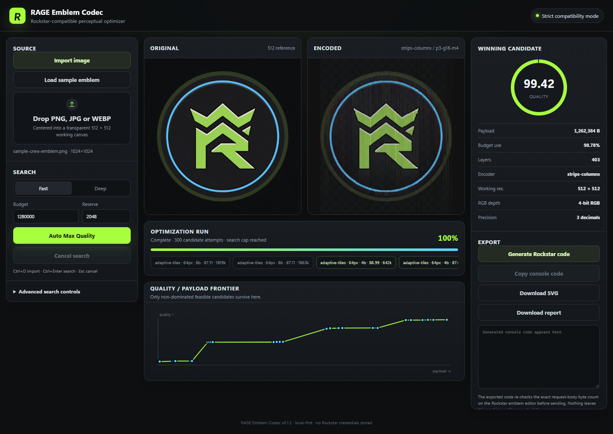
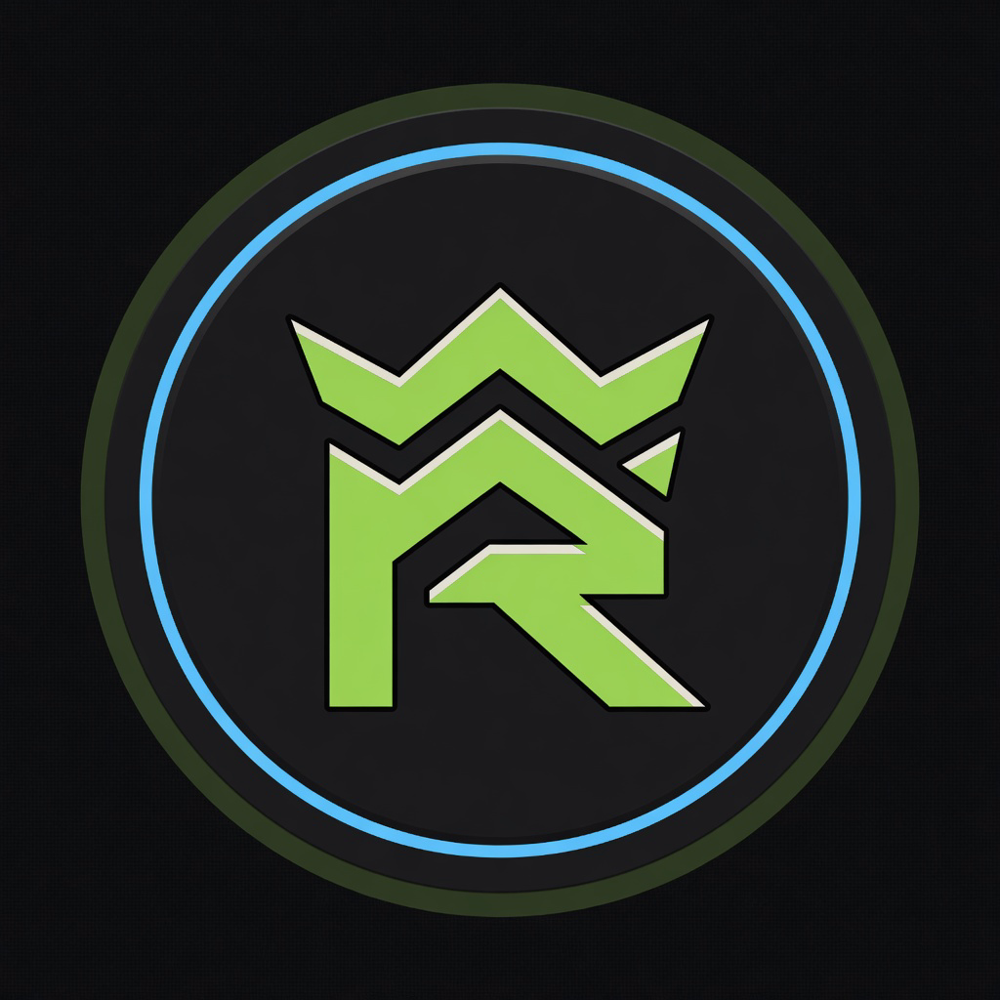

<p align="center">
  
</p>

<h1 align="center">RAGE Emblem Codec</h1>

<p align="center"><strong>Push GTA Online crew emblems to the byte limit.</strong></p>

<p align="center">
  Local-first optimizer that searches Rockstar-compatible SVG / layer encodings<br>
  and keeps the highest-quality result under the <code>1,280,000</code>-byte request budget.
</p>

<p align="center">
  <a href="https://github.com/SenjuWoo/RAGE-Emblem-Codec/actions/workflows/ci.yml"></a>
  <a href="LICENSE"></a>
  <a href="https://github.com/SenjuWoo/RAGE-Emblem-Codec/releases"></a>
  
</p>

<p align="center">
  <a href="https://senjuwoo.github.io/RAGE-Emblem-Codec/">Live demo</a>
  ·
  <a href="#run">Run locally</a>
  ·
  <a href="docs/benchmark-results.md">Benchmarks</a>
  ·
  <a href="CHANGELOG.md">Changelog</a>
</p>

<p align="center">
  
</p>

## Why it exists

Rockstar's crew emblem editor does not take a PNG. Artwork has to be represented as SVG gradients plus emblem-layer JSON, and the save request has a practical ceiling around **1,280,000 bytes**.

A clever converter is not enough. The job is:

```text
maximize perceptual quality
subject to  request size  <=  1,280,000 bytes
```

RAGE treats that as a small rate-distortion search: many candidates, one winner.

It grew out of [Emblem Helper 1.1 by Flashback-GTA](https://github.com/search?q=Emblem+Helper+Flashback-GTA), which proved the strip-to-gradient trick. This project keeps that compatibility path and replaces most of the rest.

## What you get

- Automatic maximum-quality search under a hard byte ceiling
- Upgraded row / column strip encoder with real gradient fitting
- Adaptive rectangular tile encoder for flat vs detailed regions
- Hard-edge protection so logos and text stay sharp
- Premultiplied-alpha resampling (no colored transparency halos)
- Edge-weighted perceptual scoring, Pareto frontier, Fast and Deep modes
- Runtime request-size guard in the generated Social Club console code
- 58 automated tests (codec, search, preview scaling, version / UI guards)
- Local-first: artwork never needs to leave your machine
- Tauri 2 desktop scaffold (optional; no fabricated Windows `.exe` is shipped)

<p align="center">
  
</p>

<p align="center"><sub>Documentation sample only. Not a Rockstar or Take-Two asset.</sub></p>

## Run

Node.js 20 or newer. No other runtime dependencies for the portable web app.

```powershell
git clone https://github.com/SenjuWoo/RAGE-Emblem-Codec.git
cd RAGE-Emblem-Codec
npm install
npm run serve
```

On Windows you can also double-click `start.bat`.

Then open [http://127.0.0.1:4173](http://127.0.0.1:4173), import an image (or **Load sample emblem**), and press **Auto Max Quality**.

Do not open `index.html` as a `file://` page. The worker and sample image need the local server.

### Export to Rockstar

1. Generate console code in the app.
2. Open the Social Club crew emblem editor while logged in.
3. Paste the snippet into the browser console.
4. The snippet reads the live editor token/hash, measures the real JSON body, and **aborts without sending** if it is over budget.

### Preview vs console / in-game

Original is the 512×512 letterboxed reference the codec scores against. Encoded is the same 512×512 SVG the console snippet uploads; the card only *displays* it (a viewBox is added in the page, not in the Rockstar payload).

Vertical scanlines mean the winner was a **column-strip** encode, usually below 512 working resolution. Those bands are in the SVG. The Social Club editor and in-game emblems rasterize that file, so they show — more on a large crew-page emblem, less on a tiny player-list icon. Advanced → **Strip direction → Rows only** forces the old Helper default and removes the vertical bands.

## Search modes

| Mode | Behavior |
| --- | --- |
| **Fast** | High-value strip/tile space. Stops once a feasible candidate reaches `99.995 / 100`. |
| **Deep** | No quality target. Continues until an exact reconstruction, exhaustion, or the candidate cap. |
| **Auto precision** | Tries 5, then 4, then 3 decimal geometry. Transform scales keep at least 5 decimals so 512-strip emblems stay opaque. |

## Benchmarks

Deterministic synthetic artwork, not a claim about every photo. Quality is the edge-weighted proxy (`100` = exact under that metric). Scorer unchanged from the first public benches.

| Budget | Legacy-style | RAGE v0.1.2 | Quality | Payload |
| ---: | --- | --- | ---: | ---: |
| 1,280,000 B | 98.782 @ 536,060 B | **99.9995 @ 1,276,380 B** | **+1.218** | +740,320 B |
| 120,000 B | 53.634 @ 116,928 B | **55.210 @ 84,804 B** | **+1.577** | **−32,124 B** |

At the real ceiling, spending leftover bytes is intentional. The objective is maximum quality under the cap, not the smallest file. Full JSON: [`docs/benchmark-results.md`](docs/benchmark-results.md).

```powershell
npm run benchmark
```

Override with `SIZE`, `BUDGET`, or `QUALITY_TARGET`.

## Project map

```text
src/codec/     pure encoder / search / payload math
src/worker.js  off-thread optimizer
src/main.js    browser / Tauri UI
tests/         deterministic Node tests
tools/         static server, builder, benchmark, release zip
src-tauri/     optional Tauri 2 shell (NSIS)
```

## Development

```powershell
npm test          # codec tests
npm run check     # version lock + syntax
npm run build     # static frontend -> dist/
npm run package   # portable ZIP + SHA256SUMS.txt
```

### Optional desktop app

The source is laid out for Tauri 2. On a Windows machine with the Rust stable toolchain and the MSVC build tools:

```powershell
npm install
npm run build
npm run tauri -- build
```

The bundle target is NSIS only. This repository does **not** ship a prebuilt `.exe`.

## Compatibility boundary

v0.1.2 Strict mode uses the known-safe subset:

- legacy rectangle slug
- transformed SVG paths
- linear gradients
- established emblem layer JSON

Not enabled until proven against the live editor: `<use>`, arbitrary primitives, shared CSS, radial gradients, parser-specific shortcuts.

## Honest status

Verified in this tree:

- 58 automated tests
- static frontend build
- 1,280,000-byte and 120,000-byte benchmarks
- runtime request-size guard tests
- independent SVG geometry checks from the original geometry audit

Not claimed:

- an authenticated live Rockstar save from this environment
- a compiled Windows Tauri installer from this environment
- Butteraugli / LPIPS / AI saliency / vector tracing / CUDA

## Credits

Flashback-GTA's Emblem Helper 1.1 demonstrated the core technique. See [`NOTICE.md`](NOTICE.md).

GTA, GTA Online, Social Club, and Rockstar are trademarks of their owners. This project is unofficial.

## License

[MIT](LICENSE)
